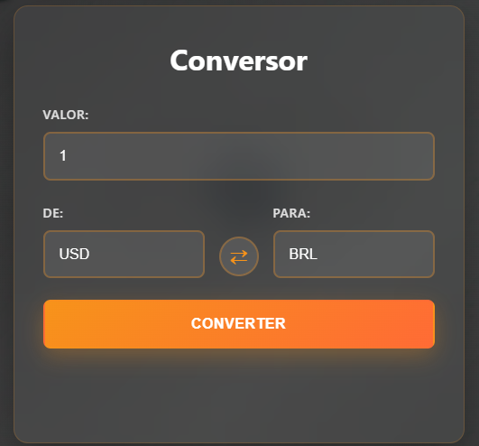
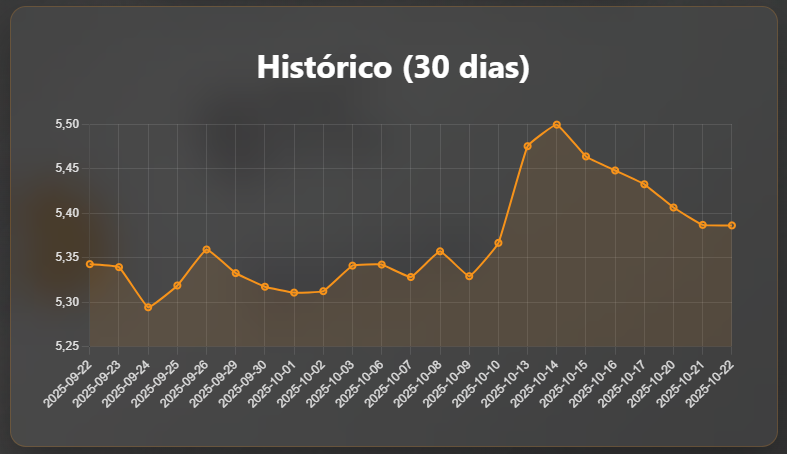
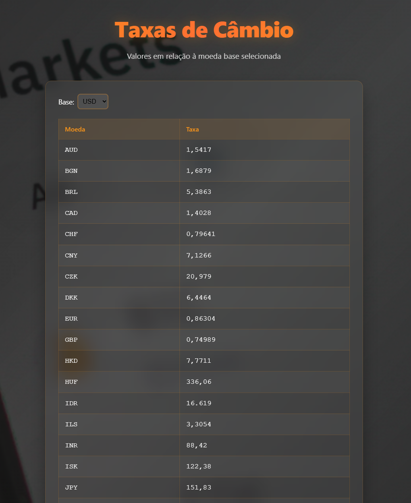
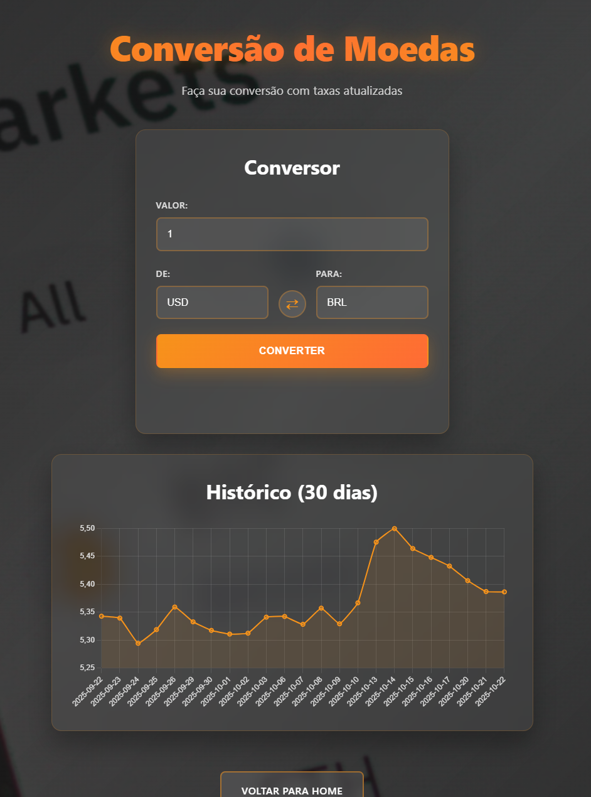

# 🪙 Conversor de Moedas

  

Um site web completo para conversão de moedas e consulta de taxas de câmbio em tempo real e valores atualizados por **minuto**. Este projeto utiliza um backend em Python para se comunicar com uma API de câmbio e um frontend em HTML, CSS e JavaScript para a interação do usuário.

## 🔗 Site do projeto
Não hospedado por enquanto...

## ✨ Funcionalidades

* **Conversão em Tempo Real:** Converta valores entre dezenas de moedas com taxas atualizadas em tempo real.
* **Tabela de Cotações:** Visualize as taxas de câmbio entre duas moedas (ex: USD e BRL).
* **Gráfico Histórico:** Veja um gráfico com a variação da taxa de câmbio dos últimos 30 dias entre as moedas selecionadas.
* **Botão de Inversão:** Troque rapidamente as moedas de "De" e "Para" com um clique.
* **Design Responsivo:** Interface limpa e moderna que se adapta a desktops e dispositivos móveis.
* **Indicadores de Carregamento:** Spinners elegantes são exibidos enquanto os dados são carregados da API.

## 📸 Imagens do projeto

| Página Inicial (Index) | Conversor | Gráfico Histórico |
| :---: | :---: | :---: |
|  |  |  |

| Tabela de Cotações | Página de Conversão |
| :---: | :---: |
|  |  |

## 🛠️ Tecnologias Utilizadas

* **Backend:**
    * Python
    * Flask (para linkar as páginas e criar a API)
    * Requests (para puxar a API)
* **Frontend:**
    * HTML
    * CSS
    * JavaScript
    * Chart.js
* **API:**
    * [Frankfurter](https://www.frankfurter.app/)

## 🔮 Futuro do projeto

Pretendo aumentar mais o projeto e relacionar o mesmo com criptomoedas em tempo real, além de expandir a quantidade de detalhes de cada página, além de hospedar o mesmo.

## 📄 Licença

Este projeto foi desenvolvido por Gabriel Beloni.
